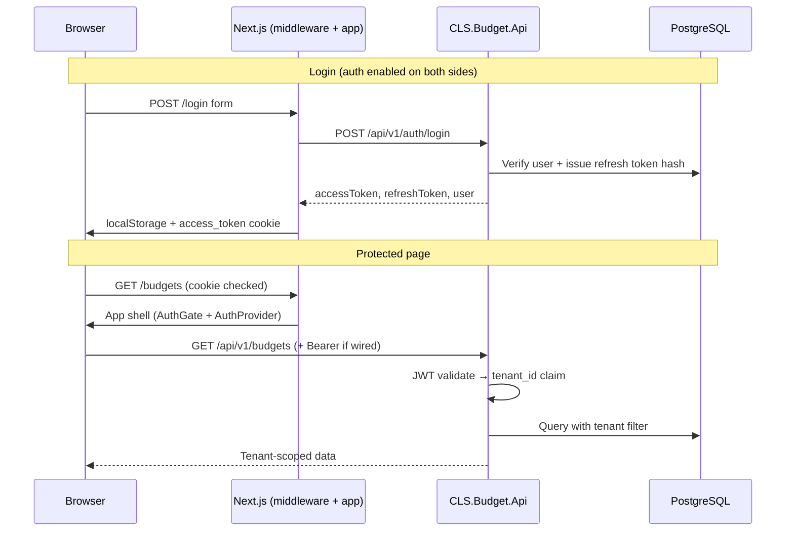

# Authentication

CLS Budget supports optional JWT authentication on the backend and a login/register flow on the frontend. For local development, both are usually **disabled** so you can use the app without signing in.

The frontend and backend settings are **independent**. Keep them aligned for the behavior you want (see [Recommended combinations](#recommended-combinations)).

---

## How authentication works

### Overview

When auth is **enabled**, the system uses a **JWT access token** (short-lived) and a **refresh token** (long-lived, stored hashed in the database). The frontend guards pages with middleware and React context; the backend validates JWTs (or uses a dev auto-login handler when auth is disabled).



When auth is **disabled**:

- **Frontend:** No redirects; `isAuthenticated` is always treated as `true`.
- **Backend:** `DevAuthenticationHandler` marks every request authenticated with fixed dev claims (`tenant_id`, `sub`, `Owner` role). No password or JWT is required.

---

### Token model

| Token | Lifetime (default) | Stored on client | Stored on server |
|-------|-------------------|------------------|------------------|
| Access JWT | 15 minutes (`Jwt:AccessTokenMinutes`) | `localStorage` key `cls_budget_access_token` + cookie `access_token` | Not stored (stateless) |
| Refresh token | 30 days (`Jwt:RefreshTokenDays`) | `localStorage` key `cls_budget_refresh_token` | SHA-256 hash in `RefreshTokens` table |

**JWT claims** (created in `TokenService.CreateAccessToken`):

| Claim | Purpose |
|-------|---------|
| `sub` | User id (`AppUser.UserId`) |
| `tenant_id` | Household tenant for data isolation |
| `email` | User email |
| `name` | Display name |
| `role` | `Owner` or `Member` (ASP.NET role claim) |
| `jti` | Unique token id |

Refresh tokens are **rotated** on each refresh: the old row is revoked (`RevokedAt` set) before a new pair is issued.

---

### Frontend mechanisms

#### 1. Configuration flag

`NEXT_PUBLIC_AUTH_ENABLED` is read once at build/runtime in `authConfig.ts`. When not `"true"`, the rest of the auth UI and guards are effectively bypassed.

#### 2. Edge middleware (first line of defense)

**File:** `frontend/cls-budget-web/middleware.ts`

Runs on every matched route before the page renders:

1. If auth disabled → pass through.
2. If path is `/login` or `/register` and user already has `access_token` cookie → redirect to `/`.
3. If path is public → pass through.
4. If no `access_token` cookie → redirect to `/login?returnUrl=...`.

The middleware only checks for the **presence** of the cookie, not JWT validity. Expired tokens are handled client-side in `AuthProvider`.

#### 3. React session (`AuthProvider`)

**File:** `src/features/auth/context/AuthContext.tsx`

Wrapped around the app in `app/layout.tsx`. Responsibilities:

| Action | Behavior |
|--------|----------|
| **Hydrate on load** | If auth enabled and access token exists → `GET /api/v1/auth/me` with `Authorization: Bearer`. On 401 → try refresh → on failure clear session. |
| **Login** | `POST /api/v1/auth/login` → `persistAuthSession` → set `user` state. |
| **Register** | `POST /api/v1/auth/register` → same as login. |
| **Logout** | Clear localStorage + cookie → `user = null` → navigate to `/login`. |

`isAuthenticated` is `user !== null` when auth is enabled; always `true` when disabled.

#### 4. Client guard (`AuthGate`)

**File:** `src/features/auth/components/AuthGate.tsx`

Second line of defense after hydration:

- Shows “Loading…” while session is restoring.
- If not authenticated and not on a public path → `router.replace('/login?returnUrl=...')`.
- Covers cases where middleware passed but React state has no user yet.

#### 5. Layout shell

**File:** `src/components/layout/AppShell.tsx`

On `/login` and `/register`, renders children **without** sidebar/bottom nav. All other routes get the main app chrome.

#### 6. Session persistence

**File:** `src/features/auth/lib/authStorage.ts`

| Storage | Key | Used by |
|---------|-----|---------|
| `localStorage` | `cls_budget_access_token` | `authApi.me`, future API calls |
| `localStorage` | `cls_budget_refresh_token` | Silent refresh in `AuthProvider` |
| Cookie | `access_token` | Next.js `middleware.ts` (SameSite=Lax, max-age from token expiry) |

#### 7. Auth API client

**File:** `src/features/auth/api/authApi.ts`

Thin wrapper over `src/lib/api/client.ts` for:

- `POST /api/v1/auth/login`
- `POST /api/v1/auth/register`
- `POST /api/v1/auth/refresh`
- `GET /api/v1/auth/me` (only call that currently sends `Authorization: Bearer`)

Browser requests go to the same origin; `next.config.ts` **rewrites** `/api/*` to `NEXT_PUBLIC_API_BASE_URL`.

#### 8. UI entry points

| Route | Component | Action |
|-------|-----------|--------|
| `/login` | `app/login/page.tsx` → `LoginForm.tsx` | Calls `useAuth().login`, then `router.replace(returnUrl \|\| '/')` |
| `/register` | `app/register/page.tsx` → `RegisterForm.tsx` | Calls `useAuth().register`, then `router.replace('/')` |

---

### Backend mechanisms

#### 1. Startup wiring

**File:** `backend/src/CLS.Budget.Api/Program.cs`

```
Read Auth:Enabled
  ├─ false (Development only)
  │    └─ Register DevAuthenticationHandler → every request authenticated as dev user
  └─ true
       └─ Register JwtBearer → validate Issuer, Audience, signing key, lifetime
Register Authorization fallback policy → authenticated user + Member or Owner role
Map controllers → UseAuthentication → UseAuthorization
```

If `Auth:Enabled` is `false` outside Development, the app **fails at startup**.

#### 2. Dev authentication (auth disabled)

**File:** `CLS.Budget.Api/Auth/DevAuthenticationHandler.cs`

Builds a fixed `ClaimsPrincipal` from `AuthOptions`:

- `sub` → `DevUserId`
- `tenant_id` → `DevTenantId`
- `email`, `name`, `role` → dev profile settings

No database lookup; no `Authorization` header required.

#### 3. JWT authentication (auth enabled)

**File:** `CLS.Budget.Infrastructure/Auth/TokenService.cs`

- Signs access tokens with HMAC-SHA256 (`Jwt:SigningKey`).
- Creates opaque refresh tokens (64 random bytes, Base64Url).
- Stores **hash only** of refresh tokens via `IRefreshTokenRepository`.

**File:** `CLS.Budget.Infrastructure/Auth/PasswordHasherAdapter.cs`

Uses ASP.NET Core `PasswordHasher<AppUser>` for register/login password verify.

#### 4. Auth application service

**File:** `CLS.Budget.Application/Auth/AuthService.cs`

| Method | Steps |
|--------|-------|
| `RegisterAsync` | Normalize email → reject duplicate → create `Tenant` + `AppUser` (Owner) → `IssueTokensAsync` |
| `LoginAsync` | Load user by email → verify password → `IssueTokensAsync` |
| `RefreshAsync` | Hash presented token → load from DB → revoke old → `IssueTokensAsync` |
| `GetCurrentUserAsync` | Load user by id from JWT `sub` |

`IssueTokensAsync`: create access JWT + refresh token row, return `AuthResponse` DTO.

#### 5. HTTP API

**File:** `CLS.Budget.Api/Controllers/AuthController.cs`

| Endpoint | Auth | Handler |
|----------|------|---------|
| `POST /api/v1/auth/register` | Anonymous | `RegisterAsync` |
| `POST /api/v1/auth/login` | Anonymous | `LoginAsync` |
| `POST /api/v1/auth/refresh` | Anonymous | `RefreshAsync` |
| `POST /api/v1/auth/forgot-password` | Anonymous | `ForgotPasswordAsync` |
| `POST /api/v1/auth/reset-password` | Anonymous | `ResetPasswordAsync` |
| `GET /api/v1/auth/me` | Bearer required | `GetCurrentUserAsync` (reads `sub` from `User`) |

#### 6. Authorization on business APIs

**Fallback policy** (in `Program.cs`): all controllers require an authenticated user with role `Member` or `Owner` unless marked `[AllowAnonymous]`.

Examples:

- `[AllowAnonymous]`: reference data controllers (`IncomeSources`, `BudgetPaymentStatuses`, etc.).
- `[Authorize(Policy = TenantMember)]`: `AccountsController`, `BudgetsController`, `PaymentsController`, …
- `[Authorize(Policy = TenantOwner)]`: destructive or admin actions on some controllers.

#### 7. Multi-tenancy (data isolation)

**File:** `CLS.Budget.Api/Auth/HttpTenantContext.cs`

Reads `tenant_id` from `HttpContext.User` claims. Falls back to `SeedTenant.DefaultTenantId` if missing.

**File:** `CLS.Budget.Infrastructure/Persistance/BudgetDbContext.cs`

- Global query filters on tenant-scoped entities: `TenantId == _tenantContext.TenantId`.
- On `SaveChanges`, new entities get `TenantId` set automatically.

So after login, every budget/account/payment query is limited to the user’s household tenant.

---

### End-to-end flows

#### Registration

1. User submits `RegisterForm` (email, password, display name, optional tenant name).
2. `AuthContext.register` → `POST /api/v1/auth/register`.
3. `AuthService` creates tenant + owner user, hashes password, issues tokens.
4. Frontend `persistAuthSession` + sets `user`.
5. Router navigates to `/`.
6. If auth enabled, middleware sees cookie on subsequent requests.

#### Password reset

1. User opens `/forgot-password` and submits their email.
2. `POST /api/v1/auth/forgot-password` creates a one-time token (60 minutes by default).
3. Reset link is sent via SMTP when `Smtp:Enabled` is true (e.g. Gmail), otherwise logged to the API console.

#### Gmail SMTP setup

1. Turn on [2-Step Verification](https://myaccount.google.com/security) for your Google account.
2. Create an [App Password](https://myaccount.google.com/apppasswords) (Google Account → Security → App passwords).
3. Add to `appsettings.Development.json` (or env vars `Smtp__*`):

```json
"Smtp": {
  "Enabled": true,
  "Host": "smtp.gmail.com",
  "Port": 587,
  "UseStartTls": true,
  "Username": "you@gmail.com",
  "Password": "16-char-app-password",
  "FromAddress": "you@gmail.com",
  "FromDisplayName": "CLS Budget"
}
```

4. Restart the API and submit forgot-password with the **same Gmail address** registered in `AppUser`.
4. User opens `/reset-password?token=...`, sets a new password.
5. `POST /api/v1/auth/reset-password` updates the hash, marks the token used, and revokes active refresh tokens.
6. User signs in at `/login` with the new password.

Configure `PasswordReset:FrontendBaseUrl` (env: `PasswordReset__FrontendBaseUrl`) to your CloudFront or Vercel URL in production.

#### Login

1. User submits `LoginForm`.
2. `POST /api/v1/auth/login` → same token persistence as register.
3. Redirect to `returnUrl` query param or `/`.

#### Session restore (page refresh)

1. `AuthProvider` mounts → `hydrate()`.
2. Read access token from `localStorage`.
3. `GET /api/v1/auth/me` with Bearer header.
4. Success → set `user`. Failure with 401 → try `POST /api/v1/auth/refresh` → on success re-persist; else clear session.

#### Accessing a protected route (e.g. `/budgets`)

1. **Middleware:** cookie present? If not → `/login?returnUrl=/budgets`.
2. **AuthGate:** wait for hydrate; if no user → client redirect to login.
3. **AppShell:** render sidebar + page.
4. Page components call APIs via `apiGet` / `apiPost` in `src/lib/api/client.ts`.

#### Logout

1. `logout()` clears `localStorage` and cookie.
2. `user` set to `null`.
3. Router pushes `/login` (when auth enabled).

---

### API calls and Bearer tokens

**Important:** `src/lib/api/client.ts` does **not** automatically attach `Authorization: Bearer` to budget/account/payment requests. Only `authApi.me` passes the token explicitly.

| Backend `Auth:Enabled` | Frontend auth | Data API calls (`/api/v1/budgets`, etc.) |
|------------------------|---------------|------------------------------------------|
| `false` | any | Work without Bearer (dev handler authenticates) |
| `true` | `false` | **401** — pages load but data fails |
| `true` | `true` | **401** unless `client.ts` is extended to send `getAccessToken()` on each request |

For production-like local testing with both flags on, extend the shared API client to add:

```ts
headers: {
  ...(getAccessToken() ? { Authorization: `Bearer ${getAccessToken()}` } : {}),
  ...
}
```

---

### File reference

#### Frontend

| Path | Role |
|------|------|
| `.env.local` / `.env.example` | `NEXT_PUBLIC_AUTH_ENABLED`, API URL |
| `middleware.ts` | Cookie-based route guard |
| `next.config.ts` | Proxy `/api/*` to backend |
| `app/layout.tsx` | `AuthProvider` → `AuthGate` → `AppShell` |
| `app/login/page.tsx` | Login page shell |
| `app/register/page.tsx` | Register page shell |
| `src/features/auth/lib/authConfig.ts` | `AUTH_ENABLED`, public paths |
| `src/features/auth/lib/authStorage.ts` | Token/cookie read/write/clear |
| `src/features/auth/context/AuthContext.tsx` | Session state, login/register/logout/hydrate |
| `src/features/auth/hooks/useAuth.ts` | Re-export context hook |
| `src/features/auth/api/authApi.ts` | Auth REST calls |
| `src/features/auth/types/auth.ts` | TS DTOs |
| `src/features/auth/components/AuthGate.tsx` | Client route guard |
| `src/features/auth/components/LoginForm.tsx` | Sign-in form |
| `src/features/auth/components/RegisterForm.tsx` | Sign-up form |
| `src/features/auth/index.ts` | Public exports |
| `src/components/layout/AppShell.tsx` | Hide chrome on auth pages |
| `src/lib/api/client.ts` | Shared `fetch` wrapper (no Bearer yet) |

#### Backend

| Path | Role |
|------|------|
| `CLS.Budget.Api/Program.cs` | JWT vs dev auth, authorization policies, pipeline |
| `CLS.Budget.Api/appsettings.json` | Production auth defaults |
| `CLS.Budget.Api/appsettings.Development.json` | Local `Auth:Enabled: false` |
| `CLS.Budget.Api/Auth/AuthOptions.cs` | `Auth` configuration model |
| `CLS.Budget.Api/Auth/DevAuthenticationHandler.cs` | Implicit dev user |
| `CLS.Budget.Api/Auth/HttpTenantContext.cs` | Tenant from JWT/dev claims |
| `CLS.Budget.Api/Auth/AuthorizationPolicies.cs` | Policy/role names |
| `CLS.Budget.Api/Controllers/AuthController.cs` | Auth HTTP endpoints |
| `CLS.Budget.Application/Auth/AuthService.cs` | Register/login/refresh/me logic |
| `CLS.Budget.Application/Auth/AuthMapper.cs` | Entity → DTO mapping |
| `CLS.Budget.Application/Auth/Dtos/*.cs` | Request/response models |
| `CLS.Budget.Application/Auth/Validators/*.cs` | FluentValidation for auth requests |
| `CLS.Budget.Application/Abstractions/Services/IAuthService.cs` | Service contract |
| `CLS.Budget.Application/Abstractions/Services/ITokenService.cs` | Token creation contract |
| `CLS.Budget.Infrastructure/Auth/TokenService.cs` | JWT + refresh token creation |
| `CLS.Budget.Infrastructure/Auth/JwtOptions.cs` | JWT configuration model |
| `CLS.Budget.Infrastructure/Auth/PasswordHasherAdapter.cs` | Password hash/verify |
| `CLS.Budget.Infrastructure/Repositories/RefreshTokenRepository.cs` | Refresh token persistence |
| `CLS.Budget.Infrastructure/Repositories/AppUserRepository.cs` | User lookup |
| `CLS.Budget.Infrastructure/Repositories/TenantRepository.cs` | Tenant creation |
| `CLS.Budget.Infrastructure/Persistance/BudgetDbContext.cs` | Tenant filters + `RefreshTokens` |
| `CLS.Budget.Domain/Entities/AppUser.cs` | User entity |
| `CLS.Budget.Domain/Entities/RefreshToken.cs` | Refresh token entity |
| `CLS.Budget.Domain/Entities/Tenant.cs` | Tenant entity |

---

## Enable and disable

### Frontend

| Variable | Values | Default if unset |
|----------|--------|------------------|
| `NEXT_PUBLIC_AUTH_ENABLED` | `true` / `false` | `false` (auth off) |

Set in `frontend/cls-budget-web/.env.local`:

```env
NEXT_PUBLIC_API_BASE_URL=http://localhost:5123
NEXT_PUBLIC_AUTH_ENABLED=false
```

Only the string `"true"` enables auth.

**Disable (typical local dev):** `NEXT_PUBLIC_AUTH_ENABLED=false` — no login redirects.

**Enable:** `NEXT_PUBLIC_AUTH_ENABLED=true` — middleware + `AuthGate` enforce login.

Restart `npm run dev` after changes.

### Backend

Configuration in `backend/src/CLS.Budget.Api/appsettings.json` and `appsettings.Development.json`.

| Key | Description |
|-----|-------------|
| `Auth:Enabled` | `true` = JWT; `false` = dev auto-login (Development only) |
| `Auth:DevTenantId`, `DevUserId`, `DevEmail`, `DevDisplayName`, `DevRole` | Dev handler identity |
| `Jwt:SigningKey` | Required when auth enabled |
| `Jwt:AccessTokenMinutes`, `Jwt:RefreshTokenDays` | Token lifetimes |

Override via environment variables, e.g. `Auth__Enabled`, `Jwt__SigningKey`.

**Disable (typical local dev):** `"Auth": { "Enabled": false }` in `appsettings.Development.json`.

**Enable:** `"Auth": { "Enabled": true }` plus a strong `Jwt:SigningKey`.

Restart the API after changes.

---

## Recommended combinations

| Frontend `NEXT_PUBLIC_AUTH_ENABLED` | Backend `Auth:Enabled` | Use case |
|-----------------------------------|------------------------|----------|
| `false` | `false` | **Default local dev** — no login, API uses dev tenant |
| `true` | `false` | Test login UI; API still accepts requests without JWT |
| `true` | `true` | **Production-like** — login required; extend API client for Bearer |
| `false` | `true` | Not recommended — pages load but API calls return 401 |

For day-to-day development, keep **both disabled**.

To exercise login locally with working data APIs, enable **both** and add Bearer headers to `client.ts` (see [API calls and Bearer tokens](#api-calls-and-bearer-tokens)).

---

## Quick reference

### Turn auth off (local dev)

1. **FE:** `NEXT_PUBLIC_AUTH_ENABLED=false` in `.env.local`
2. **BE:** `Auth:Enabled: false` in `appsettings.Development.json`
3. Restart `npm run dev` and the API

### Turn auth on

1. **BE:** `Auth:Enabled: true` and `Jwt:SigningKey`
2. **FE:** `NEXT_PUBLIC_AUTH_ENABLED=true`
3. Restart both apps
4. Register at `/register`, sign in at `/login`
5. Wire Bearer token into `src/lib/api/client.ts` for data endpoints

### Verify

| Check | Auth off | Auth on |
|-------|----------|---------|
| Open `/` | Dashboard loads | Redirects to `/login` |
| `GET /api/v1/budgets` (no token) | 200 (dev user) | 401 |
| After login | N/A | Cookie set; `/api/v1/auth/me` returns user |

Swagger (Development): `http://localhost:5123/swagger` — **Authorize** with `Bearer <access_token>` when auth is enabled.
