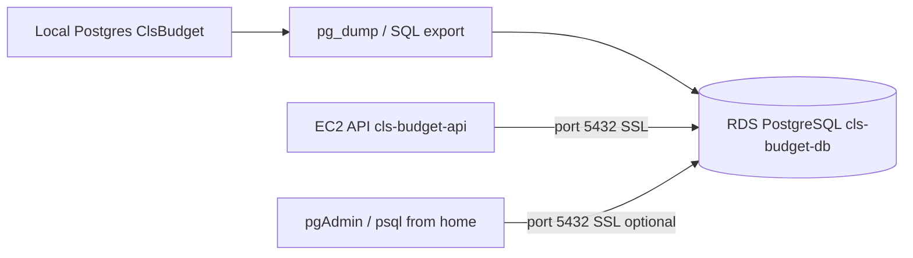

# AWS RDS PostgreSQL — Manual Setup Guide

This document describes how the **CLS Budget** database was set up on **Amazon RDS PostgreSQL**, and how to reproduce it manually in the AWS Console (or with the helper scripts in `scripts/`).

Local development stays on your PC Postgres (`appsettings.Development.json`). Production uses RDS.

---

## Overview



| Item | Value (this deployment) |
|------|-------------------------|
| AWS account | `955598401326` |
| Region | `us-east-1` |
| RDS identifier | `cls-budget-db` |
| Engine | PostgreSQL **15.x** (RDS); local `pg_dump` may be **17** |
| Instance class | `db.t4g.micro` |
| Database name | `postgres` |
| Master user | `postgres` |
| Endpoint | `cls-budget-db.cm7e8coy6c7r.us-east-1.rds.amazonaws.com` |
| RDS security group | `cls-budget-db-sg` (`sg-0f319031b99acc0b8`) |
| VPC | `vpc-06bb8f03ddc1c6eeb` |

Table names are **PascalCase** and quoted in SQL: `"Budget"`, `"AppUser"`, `"Accounts"` (not `budgets`).

---

## Prerequisites

1. **AWS account** with permissions to create RDS, EC2 security groups, and VPC rules.
2. **AWS CLI** configured (`aws configure` or SSO):
   ```powershell
   aws sts get-caller-identity
   ```
3. **PostgreSQL client tools** on your PC (`psql`, `pg_dump`) — e.g. PostgreSQL 17 under `C:\Program Files\PostgreSQL\17\bin`.
4. **Local database** running with schema + data (`ClsBudget` from `appsettings.Development.json`).
5. **Master password** for RDS — choose a strong password and store it in a password manager (never commit to Git).

---

## Part 1 — Create the RDS instance (AWS Console)

### Step 1.1 — Open RDS

1. Sign in to [AWS Console](https://console.aws.amazon.com/).
2. Region: **US East (N. Virginia) / us-east-1**.
3. Go to **RDS → Databases → Create database**.

### Step 1.2 — Engine and templates

| Setting | Value |
|---------|--------|
| Creation method | **Standard create** |
| Engine | **PostgreSQL** |
| Version | **15.x** (match or stay below your `pg_dump` major version; see [Version notes](#postgresql-version-notes)) |
| Templates | **Free tier** or **Dev/Test** |

### Step 1.3 — Instance settings

| Setting | Value |
|---------|--------|
| DB instance identifier | `cls-budget-db` |
| Master username | `postgres` |
| Master password | Your secure password |
| Confirm password | Same |

### Step 1.4 — Instance configuration

| Setting | Value |
|---------|--------|
| DB instance class | **Burstable classes → db.t4g.micro** |
| Storage | **gp3**, 20 GiB (default is fine) |
| Storage autoscaling | Optional (off is fine for dev) |

### Step 1.5 — Connectivity

| Setting | Value |
|---------|--------|
| VPC | Default VPC (same VPC as EC2 later) |
| Subnet group | **default** |
| Public access | **Yes** (needed temporarily for pgAdmin/import from home; lock down later) |
| VPC security group | **Create new** → name `cls-budget-db-sg` |
| Availability Zone | No preference |
| Database port | `5432` |

### Step 1.6 — Database name

| Setting | Value |
|---------|--------|
| Initial database name | `postgres` |

### Step 1.7 — Additional configuration (recommended)

| Setting | Value |
|---------|--------|
| Backup retention | 7 days |
| Encryption | On (default) |
| Deletion protection | Off for dev; **On** for production |

Click **Create database**. Wait until **Status** is **Available** (5–15 minutes).

### Step 1.8 — Note the endpoint

**RDS → Databases → cls-budget-db → Connectivity & security**

Copy **Endpoint**, e.g.:

```text
cls-budget-db.cm7e8coy6c7r.us-east-1.rds.amazonaws.com
```

**Npgsql connection string** (save locally, not in Git):

```text
Host=cls-budget-db.cm7e8coy6c7r.us-east-1.rds.amazonaws.com;Port=5432;Database=postgres;Username=postgres;Password=YOUR_PASSWORD;SSL Mode=Require;Trust Server Certificate=true
```

---

## Part 2 — Security group (allow your PC, then EC2)

### Step 2.1 — Allow your home IP (import / pgAdmin)

1. **EC2 → Security Groups → cls-budget-db-sg**.
2. **Inbound rules → Edit inbound rules → Add rule**:

| Type | Port | Source | Description |
|------|------|--------|-------------|
| PostgreSQL | 5432 | **My IP** | Home PC for import/pgAdmin |

3. Save rules.

### Step 2.2 — Allow EC2 API (after EC2 exists)

When the API runs on EC2, add a second rule (or replace home IP for production):

| Type | Port | Source | Description |
|------|------|--------|-------------|
| PostgreSQL | 5432 | **cls-budget-api-sg** (security group ID) | API server only |

Do **not** use `0.0.0.0/0` on port 5432 in production.

### Step 2.3 — Test connectivity from your PC

```powershell
cd C:\Repos\cls-budget-app

.\scripts\test-rds-connection.ps1 `
  -RdsConnectionString "Host=cls-budget-db.cm7e8coy6c7r.us-east-1.rds.amazonaws.com;Port=5432;Database=postgres;Username=postgres;SSL Mode=Require;Trust Server Certificate=true" `
  -Password 'YOUR_RDS_PASSWORD'
```

Expected: `TcpTestSucceeded: True` and `Login OK`.

| Failure | Fix |
|---------|-----|
| `TcpTestSucceeded: False` | RDS **Public access = Yes**; SG allows **My IP** on 5432 |
| `password authentication failed` | Wrong password → RDS → **Modify** → new master password |
| `no pg_hba.conf entry` / SSL | Client must use **SSL Require** (`PGSSLMODE=require` or Npgsql string above) |

---

## Part 3 — Export local database

Your local app uses `backend/src/CLS.Budget.Api/appsettings.Development.json` → `ClsBudget` on `localhost`.

### Step 3.1 — Apply EF migrations locally (if needed)

```powershell
cd C:\Repos\cls-budget-app\backend
dotnet ef database update `
  --project src/CLS.Budget.Migration `
  --startup-project src/CLS.Budget.Migration
```

### Step 3.2 — Export to SQL (recommended for RDS 15)

If local `pg_dump` is **v17** and RDS is **v15**, use the **SQL path** (not custom-format `pg_restore`).

```powershell
cd C:\Repos\cls-budget-app
.\scripts\export-local-db-sql.ps1
```

Output: `data/cls-budget-local.sql` (PG15-compatible; strips `transaction_timeout` from PG17 dumps).

**Alternative** — custom format (only if RDS major version ≥ local `pg_dump`):

```powershell
.\scripts\export-local-db.ps1
```

Output: `data/cls-budget-local.dump`

---

## Part 4 — Import data into RDS

### Step 4.1 — SQL import (recommended)

```powershell
.\scripts\import-rds-sql.ps1 `
  -RdsConnectionString "Host=cls-budget-db.cm7e8coy6c7r.us-east-1.rds.amazonaws.com;Port=5432;Database=postgres;Username=postgres;SSL Mode=Require;Trust Server Certificate=true" `
  -Password 'YOUR_RDS_PASSWORD'
```

Scripts set `PGSSLMODE=require` automatically.

### Step 4.2 — Custom-format import (pg_restore)

Only if versions match:

```powershell
.\scripts\import-rds.ps1 `
  -RdsConnectionString "Host=...;Port=5432;Database=postgres;Username=postgres;SSL Mode=Require;Trust Server Certificate=true" `
  -Password 'YOUR_RDS_PASSWORD'
```

### Step 4.3 — Verify data

```powershell
.\scripts\verify-rds-data.ps1 -Password 'YOUR_RDS_PASSWORD'
```

Expected:

```text
Step 1: login test (SELECT 1) ... ok
Step 2: list public tables ... Budget, AppUser, Accounts, ...
Step 3: row counts ...
RDS data verification complete.
```

---

## Part 5 — Connect with pgAdmin (optional)

| Field | Value |
|-------|--------|
| Host | RDS endpoint |
| Port | `5432` |
| Database | `postgres` |
| Username | `postgres` |
| Password | RDS master password |
| SSL mode | **Require** |

Example queries:

```sql
SELECT COUNT(*) FROM "Budget";
SELECT "Email", "DisplayName", "TenantId" FROM "AppUser";
SELECT "TenantId", "Name" FROM "Tenant";
```

Default seeded tenant (imported data):

| Field | Value |
|-------|--------|
| Tenant ID | `00000000-0000-0000-0000-000000000001` |
| Name | `MonaArthur` |

---

## Part 6 — Connect the API (EC2)

After EC2 is created (`scripts/create-ec2-api.ps1`):

1. RDS SG gets an inbound rule: **5432 from cls-budget-api-sg**.
2. API container env var:
   ```text
   ConnectionStrings__BudgetDatabase=Host=cls-budget-db....rds.amazonaws.com;Port=5432;Database=postgres;Username=postgres;Password=...;SSL Mode=Require;Trust Server Certificate=true
   ```

Deploy:

```powershell
.\scripts\deploy-api-ec2.ps1 `
  -Ec2PublicIp YOUR_EC2_IP `
  -Password 'YOUR_RDS_PASSWORD' `
  -CorsOrigin 'https://YOUR_CLOUDFRONT_URL'
```

Run **EF migrations** against RDS when schema changes.

**GitHub Actions (recommended):** Add secret `RDS_CONNECTION_STRING` (same format as below), then run **Actions → Migrate Database → Run workflow** (target: **rds**). Pushes to `main` that change `backend/src/CLS.Budget.Migration/**` also run migrations automatically.

**Local script:**

```powershell
.\scripts\migrate-supabase.ps1 -ConnectionString "Host=cls-budget-db....;Port=5432;Database=postgres;Username=postgres;Password=YOUR_PASSWORD;SSL Mode=Require;Trust Server Certificate=true"
```

**Or dotnet ef directly:**

```powershell
cd C:\Repos\cls-budget-app\backend
dotnet ef database update `
  --project src/CLS.Budget.Migration `
  --startup-project src/CLS.Budget.Migration `
  --connection "Host=cls-budget-db....;Port=5432;Database=postgres;Username=postgres;Password=YOUR_PASSWORD;SSL Mode=Require;Trust Server Certificate=true"
```

---

## Part 7 — Lock down (after migration)

1. **RDS → Modify → Connectivity → Public access → No** (if only EC2 needs access).
2. **Security group**: remove **My IP** rule on 5432; keep **EC2 security group** rule only.
3. Keep master password in a password manager; rotate via **RDS → Modify** if compromised.

---

## PostgreSQL version notes

| Scenario | Symptom | Fix |
|----------|---------|-----|
| Local `pg_dump` **17**, RDS **15** | `transaction_timeout` unrecognized on restore | Use `export-local-db-sql.ps1` + `import-rds-sql.ps1` |
| Version match | `pg_restore` works | `export-local-db.ps1` + `import-rds.ps1` |
| Upgrade path | — | RDS → Modify → engine 17, or keep SQL export path |

---

## Script reference (automation)

| Script | Purpose |
|--------|---------|
| `scripts/create-rds-postgres.ps1` | Create RDS via AWS CLI |
| `scripts/migrate-to-rds.ps1` | Full pipeline: local migrate → export → create RDS → import |
| `scripts/export-local-db-sql.ps1` | Plain SQL export (PG15 RDS) |
| `scripts/export-local-db.ps1` | Custom `.dump` export |
| `scripts/import-rds-sql.ps1` | Import `.sql` to RDS |
| `scripts/import-rds.ps1` | `pg_restore` to RDS |
| `scripts/test-rds-connection.ps1` | TCP + login test |
| `scripts/verify-rds-data.ps1` | Tables + row counts |
| `scripts/create-ec2-api.ps1` | EC2 + link RDS security group |

**Create RDS via CLI** (equivalent to Part 1):

```powershell
.\scripts\create-rds-postgres.ps1 `
  -MasterPassword 'YOUR_PASSWORD' `
  -PubliclyAccessible `
  -VpcSecurityGroupId sg-0f319031b99acc0b8
```

---

## Troubleshooting

| Symptom | Likely cause | Fix |
|---------|--------------|-----|
| `InvalidClientTokenId` | Bad AWS access keys | `aws configure` |
| `AccessDenied` on RDS | IAM user lacks RDS permissions | Attach e.g. PowerUserAccess or RDS policy |
| `getaddrinfo failed` (pgAdmin) | Public access **No** | RDS → Modify → Public access **Yes** |
| `Query failed` (old script) | Stale script copy | Use latest `verify-rds-data.ps1` (shows real psql errors) |
| `password authentication failed` | Wrong RDS password | RDS → Modify → new master password |
| Empty tables after import | Import failed partway | Re-run export + import; check `verify-rds-data.ps1` |
| API 500 + DB auth error on EC2 | Wrong password in container env | Re-run `deploy-api-ec2.ps1` with correct `-Password` |
| PowerShell `>>` continuation | Broken connection string | Single line; use `-Password` param, not `Password=` in string |

---

## Cost reminder

RDS **`db.t4g.micro`** runs **24/7** (~$12–15/month) even when the app is idle. Stopping **EC2** does not stop RDS charges. See [DEPLOYMENT.md](DEPLOYMENT.md) and consider alternatives (Supabase, Neon, Postgres on EC2) if cost is a concern.

---

## Related docs

- [DEPLOYMENT.md](DEPLOYMENT.md) — EC2 API, CloudFront frontend, env vars
- [database.md](database.md) — schema overview
- [AUTH.md](AUTH.md) — users, tenants, password reset
